# 认识数据

## 数据对象与数据属性

数据是由数据对象组成，一个数据对象代表一个实体。每个数据对象都有不同特征，称为数据的属性(attribute)。

数据的属性包含：
 - 标称属性(nominal)：值是符号或名称，主要用于分类
 - 二元属性(binary)：标称属性的一种，只有两个类别
 - 序数属性(ordinal)：值的顺序或秩（rank）有意义，相继值得差未知
 - 数值属性(numeric)：可度量的值
     - 区间标度(interval-scaled)：用相同单位的尺度衡量，没有真正的零点（即数值0不代表没有，代表相对情况），倍数无意义。
     - 比率标度(retio-scaled)：具有固定零点的数值，倍数有意义。

## 数据的基本统计描述

### 中心趋势

描述数据的中心趋势的统计量主要由：均值、中位数和众数。

#### 均值（mean）:
$$ \bar{x} = \frac{1}{N}\sum_{i=1}^{N} x_{i} \tag{1}$$

加权平均： $$ \bar{x} = \sum_{i=1}^{N} w_ix_{i} \tag{2}$$


```python
## 导入数据
import pandas as pd
data = pd.read_excel('./data/居民人均可支配收入.xlsx', index_col=0)
data.head()
```


<div>
<table border="1" class="dataframe">
  <thead>
    <tr style="text-align: right;">
      <th></th>
      <th>居民人均可支配收入中位数（元）</th>
      <th>居民人均可支配收入平均数(元)</th>
    </tr>
  </thead>
  <tbody>
    <tr>
      <th>2013年第1季度</th>
      <td>4117.2</td>
      <td>5006.1</td>
    </tr>
    <tr>
      <th>2013年第2季度</th>
      <td>3606.2</td>
      <td>4043.0</td>
    </tr>
    <tr>
      <th>2013年第3季度</th>
      <td>3976.8</td>
      <td>4507.4</td>
    </tr>
    <tr>
      <th>2013年第4季度</th>
      <td>3931.9</td>
      <td>4754.3</td>
    </tr>
    <tr>
      <th>2014年第1季度</th>
      <td>4693.6</td>
      <td>5562.2</td>
    </tr>
  </tbody>
</table>
</div>


```python
## 计算均值
data.mean(axis=0)
```


    居民人均可支配收入中位数（元）    4700.211111
    居民人均可支配收入平均数(元)    5399.833333
    dtype: float64


#### 中位数(median)
对于非对称数据，数据中心更好的度量是中位数，中位数是有序数值的中间值。


```python
## 计算中位数
data.median(axis=0)
```


    居民人均可支配收入中位数（元）    4726.80
    居民人均可支配收入平均数(元)    5351.55
    dtype: float64


#### 众数(mode)
众数是集合中出现最频繁的值，根据最高频率对应不同的值的个数，可分为单峰(unimodal)、双峰(bimodal）等。在极端情况下，如果每个数据仅出现一次，则没有众数。

对于适度倾斜的单峰数据，有如下经验关系：
$$ mean - mode \approx 3 \times (mean - median)  \tag{3} $$


```python
data.mode(axis=0) ##所有数据都只出现了一次
```


<div>
<table border="1" class="dataframe">
  <thead>
    <tr style="text-align: right;">
      <th></th>
      <th>居民人均可支配收入中位数（元）</th>
      <th>居民人均可支配收入平均数(元)</th>
    </tr>
  </thead>
  <tbody>
  </tbody>
</table>
</div>


```python
import scipy.stats as stats
from scipy.stats import skewnorm
fig = plt.figure(figsize=(16,4))

ax1 = plt.subplot(1,3,1)
a = 4
x1 = np.linspace(skewnorm.ppf(0.0001, a), skewnorm.ppf(0.9999, a), 100)
rv = skewnorm(a)
ax1.plot(x1, rv.pdf(x1),  label='frozen pdf')
plt.xlabel(u'a)正倾斜数据', fontsize=15)

ax2 = plt.subplot(1,3,2)
x2 = np.linspace( - 3,  3, 1000)
ax2.plot(x2, stats.norm.pdf(x2, 0, 1))
plt.xlabel(u'b)对称数据', fontsize=15)

ax3 = plt.subplot(1,3,3)
a = -4
x3 = np.linspace(skewnorm.ppf(0.0001, a), skewnorm.ppf(0.9999, a), 100)
rv = skewnorm(a)
ax3.plot(x3, rv.pdf(x3),  label='frozen pdf')
plt.xlabel(u'c)负倾斜数据',  fontsize=15)
```


    <matplotlib.text.Text at 0x23c391c3240>


### 离散程度

度量数据的离散程度的指标包括极差、分位数、四分位数、百分位数和四分位数极差。五数概括可以用箱线图（盒图）显示，它对于离群点的是识别是有用的。

#### 极差、四分位数和四分位数极差


```python
## 极差(range)
data.max() - data.min()
```


    居民人均可支配收入中位数（元）    2460.8
    居民人均可支配收入平均数(元)    3141.0
    dtype: float64


```python
## 第1个4分位数
data.quantile(1/4)
```


    居民人均可支配收入中位数（元）    4172.95
    居民人均可支配收入平均数(元)    4873.00
    Name: 0.25, dtype: float64


##### 四分位数极差（IQR）
$$ IQR = Q_3 - Q_1 \tag{4} $$


```python
## 四分位数极差
data.quantile(3/4) - data.quantile(1/4)
```


    居民人均可支配收入中位数（元）    985.325
    居民人均可支配收入平均数(元)    951.025
    dtype: float64


#### 箱线图和离群点
离群点的识别规则为：挑选落在第3个四分位数之上或第1个四分位数之下至少$1.5 \times IQR$处的值


```python
## 箱线图
data.boxplot()
```


    <matplotlib.axes._subplots.AxesSubplot at 0x23c39168f28>


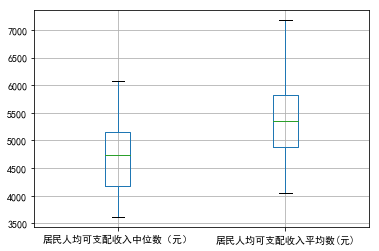


#### 方差和标准差

方差(variance):
$$ \sigma^2 = \frac{1}{N}\sum_{i=1}^{N}(x_i - \bar{x})^2 = \left ( \frac{1}{N}\sum_{i=1}^{N}x_i^2 \right )^2 - \bar{x}^2 \tag{5} $$

标准差(standard deviation) $\sigma$ 是方差 $\sigma^2$ 的平方根


```python
## 方差
data.var()
```


    居民人均可支配收入中位数（元）    416851.712810
    居民人均可支配收入平均数(元)    626944.210588
    dtype: float64


```python
## 标准差
data.std()
```


    居民人均可支配收入中位数（元）    645.640545
    居民人均可支配收入平均数(元)    791.798087
    dtype: float64


### 数据快速统计摘要


```python
data.describe()
```


<div>
<table border="1" class="dataframe">
  <thead>
    <tr style="text-align: right;">
      <th></th>
      <th>居民人均可支配收入中位数（元）</th>
      <th>居民人均可支配收入平均数(元)</th>
    </tr>
  </thead>
  <tbody>
    <tr>
      <th>count</th>
      <td>18.000000</td>
      <td>18.000000</td>
    </tr>
    <tr>
      <th>mean</th>
      <td>4700.211111</td>
      <td>5399.833333</td>
    </tr>
    <tr>
      <th>std</th>
      <td>645.640545</td>
      <td>791.798087</td>
    </tr>
    <tr>
      <th>min</th>
      <td>3606.200000</td>
      <td>4043.000000</td>
    </tr>
    <tr>
      <th>25%</th>
      <td>4172.950000</td>
      <td>4873.000000</td>
    </tr>
    <tr>
      <th>50%</th>
      <td>4726.800000</td>
      <td>5351.550000</td>
    </tr>
    <tr>
      <th>75%</th>
      <td>5158.275000</td>
      <td>5824.025000</td>
    </tr>
    <tr>
      <th>max</th>
      <td>6067.000000</td>
      <td>7184.000000</td>
    </tr>
  </tbody>
</table>
</div>


## 数据可视化

### 数据的基本统计描述的图形显示

#### 分位数图(quantile plot)

分位数图是一种观察单变量数据分布的简单有效方法,首先显示给定属性的所有数据，其次它绘出了分数数信息。


```python
fig = plt.figure(figsize=(12,4))
ax = fig.add_subplot(121)
x = data.iloc[:,0]
stats.probplot(x, plot=ax)
plt.ylabel(u'居民人均可支配收入中位数', fontsize=13)
plt.xlabel(u'f 值', fontsize=13)

ax = fig.add_subplot(122)
x = data.iloc[:,1]
stats.probplot(x, plot=ax)
plt.ylabel(u'居民人均可支配收入平均数', fontsize=13)
plt.xlabel(u'f 值', fontsize=13)

plt.show()
```


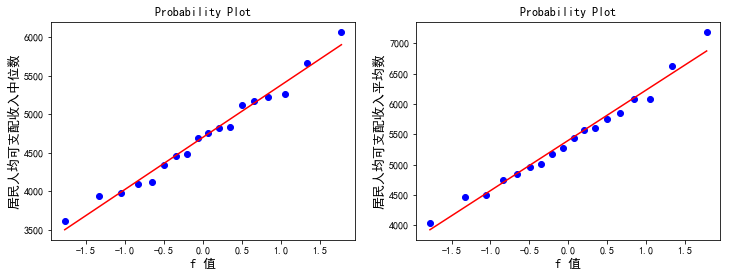


#### 分位数-分位数图（Q-Q图）
q-q图对着另一个对应的分位数，绘制一个单标量分布的分位数。它可使得用户可以观察从一个分布到另一个分布是否有漂移。


```python
import statsmodels.api as sm
fig = plt.figure()
ax = fig.add_subplot(111)
a = sm.qqplot_2samples(data.iloc[:,0], data.iloc[:,1], xlabel=u'居民人均可支配收入中位数', ylabel=u'居民人均可支配收入平均数', line='r' ,ax=ax)
```


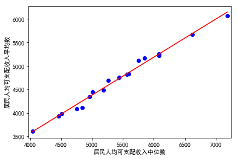


#### 直方图(histogram)


```python
data.hist(bins=10,figsize=(12,4))
```


    array([[<matplotlib.axes._subplots.AxesSubplot object at 0x0000023C3ACC5A58>,
            <matplotlib.axes._subplots.AxesSubplot object at 0x0000023C3AD61668>]], dtype=object)


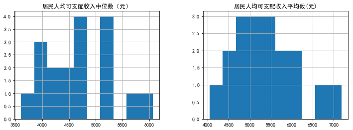


#### 散点图(scatter)
散点图是确定两个数值变量之间看上去是否存在联系、模式或趋势的最有效图形方法之一。


```python
data.plot.scatter(*data.columns)
```


    <matplotlib.axes._subplots.AxesSubplot at 0x23c39342748>


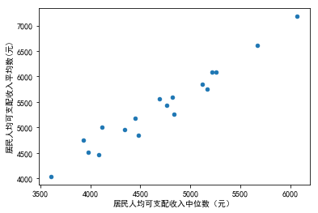


### 其他可视化基本图形


```python
data2 = pd.read_excel('.\data\各省份收入数据.xlsx', index_col=0)
data2.head()
```


<div>
<table border="1" class="dataframe">
  <thead>
    <tr style="text-align: right;">
      <th></th>
      <th>工资性收入</th>
      <th>家庭性收入</th>
      <th>财产性收入</th>
      <th>转移性收入</th>
    </tr>
  </thead>
  <tbody>
    <tr>
      <th>北京</th>
      <td>4524.25</td>
      <td>1778.33</td>
      <td>588.04</td>
      <td>455.64</td>
    </tr>
    <tr>
      <th>天津</th>
      <td>2720.85</td>
      <td>2626.46</td>
      <td>152.88</td>
      <td>79.64</td>
    </tr>
    <tr>
      <th>河北</th>
      <td>1293.50</td>
      <td>1988.58</td>
      <td>93.74</td>
      <td>105.81</td>
    </tr>
    <tr>
      <th>山西</th>
      <td>1177.94</td>
      <td>1563.52</td>
      <td>62.70</td>
      <td>86.49</td>
    </tr>
    <tr>
      <th>内蒙古</th>
      <td>504.46</td>
      <td>2223.26</td>
      <td>73.05</td>
      <td>188.10</td>
    </tr>
  </tbody>
</table>
</div>


#### 曲线图(plot)


```python
data2.plot()
```


    <matplotlib.axes._subplots.AxesSubplot at 0x23c3934b438>


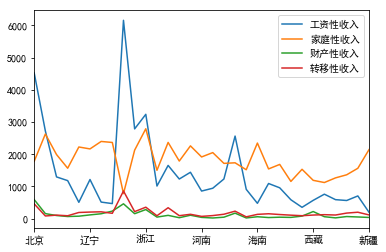


#### 柱状图


```python
data2.plot(kind='bar', stacked=True, color=['blue','gold', 'green', 'red'], figsize=(10,5))
```


    <matplotlib.axes._subplots.AxesSubplot at 0x23c3aea0d68>


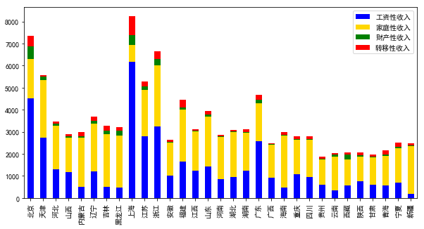


#### 面积图


```python
data2.plot.area(stacked=True)
```


    <matplotlib.axes._subplots.AxesSubplot at 0x23c392ee860>


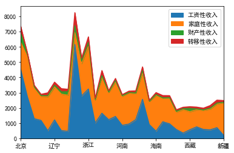


#### 饼图


```python
data2.plot.pie(y=data2.columns[0], figsize=(10,10))
```


    <matplotlib.axes._subplots.AxesSubplot at 0x23c3b2c60f0>


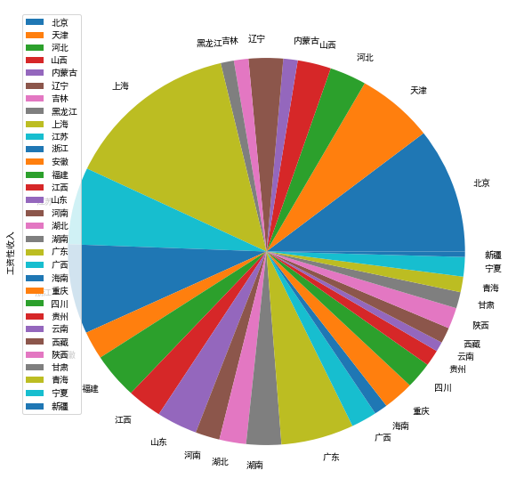


### 其他可视化图


```python
from scipy import stats, integrate
import seaborn as sns
```


```python
ax = sns.boxplot(data=data2)
ax = sns.stripplot(data=data2, jitter=True, edgecolor="gray")
```


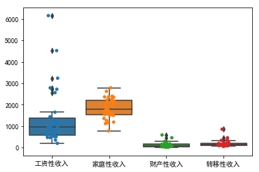


```python
sns.violinplot( data=data2, size=6)
```


    <matplotlib.axes._subplots.AxesSubplot at 0x23c3b864668>


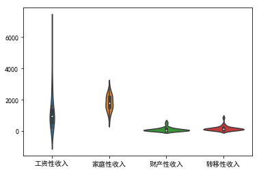


```python
sns.jointplot(x=data2.columns[0], y=data2.columns[1], data=data2, size=5)
```


    <seaborn.axisgrid.JointGrid at 0x23c3b8825f8>


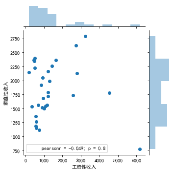


```python
g = sns.PairGrid(data2, hue=data2.columns[2])
g.map(plt.scatter, s=50, edgecolor="white")
g.map_offdiag(plt.scatter)
g.add_legend();
```


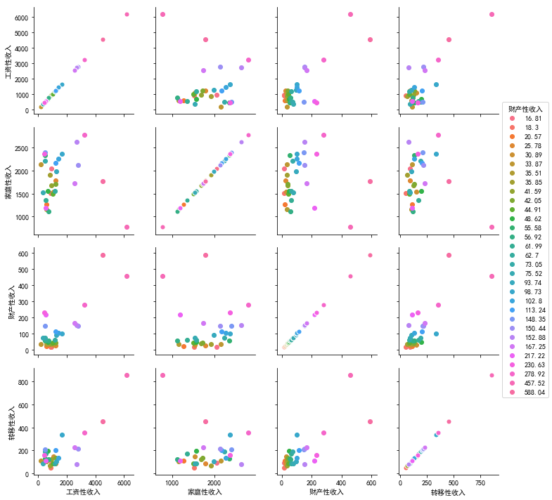


## 数据的相异性与相似性

在诸如聚类、离群点分析和最邻近分类等数据挖掘应用中，我们需要评估对象之间相互比较的相似性与相异性。相似性和相异性都称为临近性（proximity），如果两个对象$i$和$j$不相似,则它们相似性度量值为0,如果完全相似则为1。因此，我们可以构造数据的想异性矩阵，用来表示$n$个对象两两之间的邻近度。
$$
\begin{bmatrix}
 0&  &  & &\\
 d(2,1)&  0&  & &\\
 d(3,1)&  d(3,2)&  0& &\\
 \vdots&  \vdots&  \vdots& &\\
 d(n,1)&  d(n,2)&  \dots& \dots&0
\end{bmatrix}
\tag{6}
$$

其中$d(i,j)$是对象之间的想异性，一般而言，$d(i,j)$是一个非负的数值，对象$i$和$j$越接近，其值越接近0；如果越不同，该值越大。

### 标称属性的临近性度量
标称属性有多个状态，设其状态数目为$M$，这些状态用一组整数表示（整数只用书数据处理，不代表特定顺序）。两个对象$i$和$j$之间的相异性可以根据不匹配率来计算：

$$d(i,j) = \frac{p-m}{p} \tag{7}$$

其中，$m$是匹配的数目，即($i$和$j$取值相同状态的属性值），而$p$是刻画对象属性总数。


```python
data3 = pd.DataFrame({
    'test-1': ['A', 'B', 'C', 'A'],
    'test-2': [u'优秀',u'一般',u'好',u'优秀'],
    'test-3': [45, 22, 64, 28]
                     })
data3
```


<div>
<table border="1" class="dataframe">
  <thead>
    <tr style="text-align: right;">
      <th></th>
      <th>test-1</th>
      <th>test-2</th>
      <th>test-3</th>
    </tr>
  </thead>
  <tbody>
    <tr>
      <th>0</th>
      <td>A</td>
      <td>优秀</td>
      <td>45</td>
    </tr>
    <tr>
      <th>1</th>
      <td>B</td>
      <td>一般</td>
      <td>22</td>
    </tr>
    <tr>
      <th>2</th>
      <td>C</td>
      <td>好</td>
      <td>64</td>
    </tr>
    <tr>
      <th>3</th>
      <td>A</td>
      <td>优秀</td>
      <td>28</td>
    </tr>
  </tbody>
</table>
</div>


```python
## 计算test-1
test1 = data3['test-1'].values
dis_1 = np.zeros([len(test1), len(test1)])
for i in range(len(test1)):
    for j in range(i, len(test1)):
        if test1[i] != test1[j]:
            dis_1[j ,i] =1
dis_1
```


    array([[ 0.,  0.,  0.,  0.],
           [ 1.,  0.,  0.,  0.],
           [ 1.,  1.,  0.,  0.],
           [ 0.,  1.,  1.,  0.]])


我们看到除了对象1和4（$d(4,1)=0$）之外，其他都不相似。

相似性也可以用下式公式计算：
$$sim(i,j)=1-d(i,j)=\frac{m}{p} \tag{8}$$

### 二元属性的邻近性度量
我们考虑对称和非对称二元属性刻画对象的想异性和相似性度量。

|     | 1 	  | 0 	  |
|---	|---	|---	|
| 1 	| q 	| r 	|
| 0 	| s 	| t 	|

对于对对称的二元相异性，可以定义为：
$$d(i,j) = \frac{r+s}{q+r+s+t} \tag{9} $$

对于非对称的二元相异性，可以为t是不重要的，因此可以定义为：
$$ d(i,j) = \frac{r+s}{q+r+s} \tag{10} $$

同样，我们也可以基于相似性来度两个个属性的差别，如对于非对称的二元相似性可以用下式计算：
$$ sim(i,j)=\frac{q}{q+r+s}= 1-d(i,j) \tag{11} $$
（11）式中的系数$sim(i,j)$被称为Jaccard系数，它在文献中被广泛应用。


```python
data4 = pd.DataFrame([['M', 'Y', 'N', 'P', 'N', 'N', 'N'],['M', 'Y', 'Y', 'N', 'N', 'N','N'],['F', 'Y', 'N', 'P', 'N', 'P', 'N']])
data4.columns = ['gender', 'fever', 'cough', 'test-1','test-2','test-3','test-4']
data4.index = ['Jace', 'Jim', 'Mary']
data4
```


<div>
<table border="1" class="dataframe">
  <thead>
    <tr style="text-align: right;">
      <th></th>
      <th>gender</th>
      <th>fever</th>
      <th>cough</th>
      <th>test-1</th>
      <th>test-2</th>
      <th>test-3</th>
      <th>test-4</th>
    </tr>
  </thead>
  <tbody>
    <tr>
      <th>Jace</th>
      <td>M</td>
      <td>Y</td>
      <td>N</td>
      <td>P</td>
      <td>N</td>
      <td>N</td>
      <td>N</td>
    </tr>
    <tr>
      <th>Jim</th>
      <td>M</td>
      <td>Y</td>
      <td>Y</td>
      <td>N</td>
      <td>N</td>
      <td>N</td>
      <td>N</td>
    </tr>
    <tr>
      <th>Mary</th>
      <td>F</td>
      <td>Y</td>
      <td>N</td>
      <td>P</td>
      <td>N</td>
      <td>P</td>
      <td>N</td>
    </tr>
  </tbody>
</table>
</div>


```python
## 转换成数值型
label_map = {'Y': 1, 'N': 0, 'P': 1}
data4_num = data4.copy()
for column in data4.columns:
    data4_num[column] = data4[column].map(label_map)
data4_num.drop('gender', axis=1, inplace=True)
data4_num
```


<div>
<table border="1" class="dataframe">
  <thead>
    <tr style="text-align: right;">
      <th></th>
      <th>fever</th>
      <th>cough</th>
      <th>test-1</th>
      <th>test-2</th>
      <th>test-3</th>
      <th>test-4</th>
    </tr>
  </thead>
  <tbody>
    <tr>
      <th>Jace</th>
      <td>1</td>
      <td>0</td>
      <td>1</td>
      <td>0</td>
      <td>0</td>
      <td>0</td>
    </tr>
    <tr>
      <th>Jim</th>
      <td>1</td>
      <td>1</td>
      <td>0</td>
      <td>0</td>
      <td>0</td>
      <td>0</td>
    </tr>
    <tr>
      <th>Mary</th>
      <td>1</td>
      <td>0</td>
      <td>1</td>
      <td>0</td>
      <td>1</td>
      <td>0</td>
    </tr>
  </tbody>
</table>
</div>


```python
## 调用scipy计算jaccard 相异性
from scipy.spatial.distance import jaccard
jaccard(data4_num.iloc[0,:], data4_num.iloc[1,:])
```


    0.66666666666666663


```python
## 或者使用sklearn 计算jaccard
from sklearn.metrics import jaccard_similarity_score
jaccard_similarity_score(data4_num.iloc[0,:], data4_num.iloc[1,:])
```


    0.66666666666666663


```python
## 或者调用pdist计算所有jaccard
from scipy.spatial.distance import pdist
pdist(data4_num, metric='jaccard')
```


    array([ 0.66666667,  0.33333333,  0.75      ])


### 数值属性相异性
计算数值属性的相异性，一般我们常用的是距离。我们最常用的距离是欧几里得距离，其他被广泛应用的距离还有：曼哈顿距离、闵可夫斯基距离。

距离公式都需要满足如下四个条件：
- **非负性**： $d(i,j)\geqslant 0$：距离是一个非负的数值
- **同一性**： $d(i,j)= 0$： 对象到自身的距离为0
- **对称性**：  $d(i,j)= d(j,i) $：距离是一个对称的函数
- **三角不等式**： $d(i,j) \leqslant d(i,k) + d(k,j)$：从对象$i$到对象$j$的直接距离不会大于途经任何其他对象$k$的距离。

欧几里得距离(euclidean)：$$ d(i,j) = \sqrt{(x_{i1}-x_{j1})^2+(x_{i2}-x_{j2})^2+\dots+(x_{in}-x_{jn})^2} \tag{12}$$

曼哈顿距离(Manhattan)： $$ d(i,j) = \left |x_{i1}-x_{j1} \right | + \left |x_{i2}-x_{j2} \right | + \dots + \left |x_{in}-x_{jn} \right | \tag{13}$$

闵可夫斯基距离(Minkowski):$$ d(i,j) = \sqrt[h]{\left |x_{i1}-x_{j1} \right |^h + \left |x_{i2}-x_{j2} \right |^h + \dots + \left |x_{in}-x_{jn} \right |^h} \tag{14}$$

切比雪夫距离（Chebyshev）或称上界距离（$L_{max}$）,是$L \to \infty$时闵可夫斯基距离的推广：
$$ d(i,j) = \lim_{h\to\infty} \left( \sum_{f=1}^{n} x_{if} - x_{jf} \right)^{\frac{1}{h}} = \max_{f}^{n}\left| x_{if}-x_{jf} \right| \tag{15} $$


```python
from scipy.spatial import distance
x1 = np.arange(0,5)
x2 = np.arange(5,10)
print('x1:',x1)
print('x2:',x2)
```

    x1: [0 1 2 3 4]
    x2: [5 6 7 8 9]


```python
## 欧几里德距离
distance.euclidean(x1, x2)
```


    11.180339887498949


```python
## 闵可夫斯基距离
distance.minkowski(x1, x2, p=3) ## p=1时为曼哈顿距离 p=2时为欧几里得距离
```


    8.5498797333834844


```python
## 切比雪夫距离
distance.chebyshev(x1, x2)
```


    5


```python
##计算矩阵的距离

## 欧几里德距离
pdist(data4_num, metric='euclidean')

## 闵可夫斯基距离
pdist(data4_num, metric='minkowski', p=5) ## p=1时为曼哈顿距离

## 切比雪夫距离
pdist(data4_num, metric='chebyshev')
```


    array([ 1.,  1.,  1.])


### 序数属性的邻近性度量
序数属性的值之间具有意义的序（rank），而相继值之间的值未知。序数属性的处理与数值属性非常相似。
1. 用数值排位$1, \dots, M_f$取代$x_{if}$
2. 再将数值映射到$[0,1]$区间，使得每个属性都有相同的权重:$$ z_{if} = \frac{r_{if} - 1}{M_f -1} \tag{16}$$
3. 当成数值属性计算邻近性


```python
##处理data3的test-2
data3
```


<div>
<table border="1" class="dataframe">
  <thead>
    <tr style="text-align: right;">
      <th></th>
      <th>test-1</th>
      <th>test-2</th>
      <th>test-3</th>
    </tr>
  </thead>
  <tbody>
    <tr>
      <th>0</th>
      <td>A</td>
      <td>优秀</td>
      <td>45</td>
    </tr>
    <tr>
      <th>1</th>
      <td>B</td>
      <td>一般</td>
      <td>22</td>
    </tr>
    <tr>
      <th>2</th>
      <td>C</td>
      <td>好</td>
      <td>64</td>
    </tr>
    <tr>
      <th>3</th>
      <td>A</td>
      <td>优秀</td>
      <td>28</td>
    </tr>
  </tbody>
</table>
</div>


```python
## 转换成数值型
test_2_map = {u'优秀': 3,
              u'好': 2,
              u'一般':1
             }
x = data3['test-2'].map(test_2_map)
x
```


    0    3
    1    1
    2    2
    3    3
    Name: test-2, dtype: int64


```python
## 规范化
x_scale = (x - 1) / (x.max() - 1)
x_scale
```


    0    1.0
    1    0.0
    2    0.5
    3    1.0
    Name: test-2, dtype: float64


```python
## 计算欧几里得距离
dis_2 = pdist(x_scale.values.reshape(-1,1))
dis_2
```


    array([ 1. ,  0.5,  0. ,  0.5,  1. ,  0.5])


### 混合类型属性相异性
前面我么分别介绍了不同类型属性的处理方法，但是在实际中，我们数据处理的属性往往混合了不同类型的属性。我们可以分别计算每种类型属性的相异性，然后将值映射到$[0,1]$区间，再进行加权平均：
$$ d(i,j) = \frac{\sum_{f=1}^n\delta_{ij}^{(f)}d_{ij}^{(f)}}{\sum_{f=1}^n\delta_{ij}^{(f)}} \tag{17} $$

其中，如果$x_{if}=0$或$x_{jf}=0$，指示符$\delta_{ij}^{(f)}=0$,并且$f$是非对称的二元属性；否则$\delta_{ij}^{(f)}=1$。

- $f$是数值的：$d_{ij}^{(f)} = \frac{\left|x_{if} - x_{jf}\right|}{\max_hx_{hf} - \min_hx_{hf}}$
- $f$是表称或二元的：如果$x_{if}=x_{jf}$,则$d_{ij}^{(f)}=0$；否则$d_{ij}^{(f)}=1$
- $f$是序数的：计算排位$r_{if}$和$ z_{if} = \frac{r_{if} - 1}{M_f -1} $，并将$ z_{if}$当成数值属性对待


```python
## 对data3进行处理
data3
```


<div>
<table border="1" class="dataframe">
  <thead>
    <tr style="text-align: right;">
      <th></th>
      <th>test-1</th>
      <th>test-2</th>
      <th>test-3</th>
    </tr>
  </thead>
  <tbody>
    <tr>
      <th>0</th>
      <td>A</td>
      <td>优秀</td>
      <td>45</td>
    </tr>
    <tr>
      <th>1</th>
      <td>B</td>
      <td>一般</td>
      <td>22</td>
    </tr>
    <tr>
      <th>2</th>
      <td>C</td>
      <td>好</td>
      <td>64</td>
    </tr>
    <tr>
      <th>3</th>
      <td>A</td>
      <td>优秀</td>
      <td>28</td>
    </tr>
  </tbody>
</table>
</div>


```python
dis_1
```


    array([[ 0.,  0.,  0.,  0.],
           [ 1.,  0.,  0.,  0.],
           [ 1.,  1.,  0.,  0.],
           [ 0.,  1.,  1.,  0.]])


```python
dis_2
```


    array([ 1. ,  0.5,  0. ,  0.5,  1. ,  0.5])


```python
## 计算test-3
dis_3 = pdist(data3['test-3'].values.reshape(-1,1),metric='minkowski',p=1) / (data3['test-3'].max() - data3['test-3'].min())
dis_3
```


    array([ 0.54761905,  0.45238095,  0.4047619 ,  1.        ,  0.14285714,
            0.85714286])


```python
## 转换dis_1
dis_1_ = np.array([1,1,0,1,1,1])
```


```python
dis_all = np.sum((dis_1_, dis_2, dis_3), axis=0)/ 3
#dis_all = np.sum((dis_1_, dis_2, dis_3), axis=0)/ (2 + dis_1_)
dis_all
```


    array([ 0.84920635,  0.65079365,  0.13492063,  0.83333333,  0.71428571,
            0.78571429])


### 余弦相似性
余弦相似性是一种度量，可以用于比较文档，或针对给定的查询词向量对文档排序。令$x$和$y$是两个待比较的向量，使用余弦相似函数，我们有：
$$sim(x,y) = \frac{x \cdot y}{\left\|x \right\| \left\|y\right\|}  \tag{18}$$
余弦值为0意味着两个向量没有匹配，余弦值越接近1，匹配程度越大。


```python
data5 = pd.DataFrame([[5,0,3,0,2,0,0,2,0,0],[3,0,2,0,1,1,0,1,0,1,],[0,7,0,2,1,0,0,3,0,0,],[0,1,0,0,1,2,2,0,3,0,]])
data5.columns = ['team', 'coach', 'hocky', 'baseball', 'soccer', 'penalty', 'score', 'win', 'loss', 'season']
data5
```


<div>
<table border="1" class="dataframe">
  <thead>
    <tr style="text-align: right;">
      <th></th>
      <th>team</th>
      <th>coach</th>
      <th>hocky</th>
      <th>baseball</th>
      <th>soccer</th>
      <th>penalty</th>
      <th>score</th>
      <th>win</th>
      <th>loss</th>
      <th>season</th>
    </tr>
  </thead>
  <tbody>
    <tr>
      <th>0</th>
      <td>5</td>
      <td>0</td>
      <td>3</td>
      <td>0</td>
      <td>2</td>
      <td>0</td>
      <td>0</td>
      <td>2</td>
      <td>0</td>
      <td>0</td>
    </tr>
    <tr>
      <th>1</th>
      <td>3</td>
      <td>0</td>
      <td>2</td>
      <td>0</td>
      <td>1</td>
      <td>1</td>
      <td>0</td>
      <td>1</td>
      <td>0</td>
      <td>1</td>
    </tr>
    <tr>
      <th>2</th>
      <td>0</td>
      <td>7</td>
      <td>0</td>
      <td>2</td>
      <td>1</td>
      <td>0</td>
      <td>0</td>
      <td>3</td>
      <td>0</td>
      <td>0</td>
    </tr>
    <tr>
      <th>3</th>
      <td>0</td>
      <td>1</td>
      <td>0</td>
      <td>0</td>
      <td>1</td>
      <td>2</td>
      <td>2</td>
      <td>0</td>
      <td>3</td>
      <td>0</td>
    </tr>
  </tbody>
</table>
</div>


```python
## 计算单个余弦相似性
1 - distance.cosine(data5.iloc[0,:], data5.iloc[1,:])
```


    0.93560148570639967


```python
## 计算所有余弦相似性
1 - pdist(data5, metric='cosine')
```


    array([ 0.93560149,  0.15552316,  0.07079923,  0.12222647,  0.16692447,
            0.23122933])


##### 课后习题2.6
求 $x=(22,1,42,10)$ 和 $y=(20,0,36,8)$ 各种距离：
- 欧几里得距离
- 曼哈顿距离
- 闵可夫斯基距离（$q=3$）
- 上确界距离


```python
from scipy.spatial import distance
x=np.array([22,1,42,10])
y=np.array([20,0,36,8])
```


```python
## 欧几里得距离
distance.euclidean(x,y)
```


    6.7082039324993694


```python
## 曼哈顿距离
distance.minkowski(x, y , p=1)
```


    11.0


```python
## 闵可夫斯基距离(p=3)
distance.minkowski(x, y, p=3)
```


    6.1534494936636817


```python
## 切比雪夫上确界距离
distance.chebyshev(x, y)
```


    6
